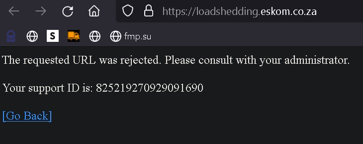

# Loadshedding API doc

[](img/logo.png)

---

*Developed by C.A Torino, TECHRAD Radical Technology*
* Links to TECHRAD ZA.
    * [Website](https://www.techrad.co.za)
    * [Tutorial website](https://tutorials.techrad.co.za)
    * [Support website](https://support.techrad.co.za)
    * [API](https://www.techrad.co.za/apisource/public/apps/fusio)

Check out [my article](https://tutorials.techrad.co.za/2022/10/06/practically-using-the-load-shedding-api) and my [practical example](https://github.com/Cale-Torino/Practical_Usage_Load_Shedding_API) for an example application use case.

Check out [This](https://www.youtube.com/watch?v=6gF2dYQ-NdM) interview with **Andre Marinus de Ruyter**.

In South Africa there is a massive shortage of electricity. Compounded by incompetent governance.
In order to stretch out the resources we have rolling blackouts implemented by ESKOM (South African electricity public utility).
Below is a way to get the times of when the blackout will start and end for every district in South Africa via a Web API.

**NB**
I noticed recently the `https://loadshedding.eskom.co.za` url has a _requested rejected_ error. 

If this is the case for you.. please use the [**ESP** API](https://eskomsepush.gumroad.com/l/api). 

If you are not a business... you can get a free token on a monthly plan and 50 requests per day.

[](img/1.jpg)

[](img/2.jpg)

[](img/3.jpg)

## 1. Get Status

`Get status of loadshedding` [*Check if there is any loadshedding*]

-------------------

### Calling Parameters (Input)
| Parameter  |  Mode  | Description  | example values  |
| :------------ | :------------ | :------------ | :------------ |
|`NULL`      |NULL |NULL      |NULL |

### Interface Address

https://loadshedding.eskom.co.za/LoadShedding/GetStatus

### Request Method

- HTTP 
- GET 
- POST

### Response Parameters (Output)
| Parameter  |  Mode  | Description  | example values  |
| :------------ | :------------ | :------------ | :------------ |
|`integer`      |int      |Https        |1    |

### Example:

- Returned data: 
   - Is a single character/value. If less than 1 then discard. If more or equal subtract 1 for the current stage.
- Example: 
   - 1 = No load shedding, 2 = Stage 1, 3 = Stage 2, 4 = Stage 3, 5 = Stage 4


### Response Result Example
```

//1 means no loadshedding
1

```

--------------------------------------------------------------------------------------------------------------------------------------------------------
--------------------------------------------------------------------------------------------------------------------------------------------------------
--------------------------------------------------------------------------------------------------------------------------------------------------------

## 2. Get Municipalities

`Get Municipalities` [*get the municipalities using the API*]

-------------------

### Calling Parameters (Input)
| Parameter  |  Mode  | Description  | example values  |
| :------------ | :------------ | :------------ | :------------ |
|`Id=`   |int |municipalitie id   |9 |


### Province IDs:
- 1 = Eastern Cape
- 2 = Free State
- 3 = Gauteng
- 4 = KwaZulu-Natal
- 5 = Limpopo
- 6 = Mpumalanga
- 7 = North West
- 8 = Northern Cape
- 9 = Western Cape

### Interface Address

https://loadshedding.eskom.co.za/LoadShedding/GetMunicipalities/?Id=4

### Request Method

- HTTP 
- GET 
- POST

### Response Parameters (Output)
| Parameter  |  Mode  | Description  | example values  |
| :------------ | :------------ | :------------ | :------------ |
|`Selected`  |boolean     |is selected |false         |
|`Text`      |String      |name        |Beaufort West |
|`Value`     |String      |value       |336           |


### Response Result Example
```json

[
   {
      "Selected":false,
      "Text":"Beaufort West",
      "Value":"336"
   }
]

```

--------------------------------------------------------------------------------------------------------------------------------------------------------
--------------------------------------------------------------------------------------------------------------------------------------------------------
--------------------------------------------------------------------------------------------------------------------------------------------------------

## 3. Get Surburb Data

`Get The Surburb Data` [*get the surburb data using the API*]

-------------------

### Calling Parameters (Input)
| Parameter  |  Mode  | Description  | example values  |
| :------------ | :------------ | :------------ | :------------ |
|`pageSize` |int |size of the page |100 |
|`pageNum`  |int |number of pages  |1 |
|`id`       |int |id               |336 |

### Interface Address

http://loadshedding.eskom.co.za/LoadShedding/GetSurburbData/?pageSize=100&pageNum=1&id=340

### Example:

- List suburbs of municipality:
- Call: http://loadshedding.eskom.co.za/LoadShedding/GetSurburbData/?pageSize=100&pageNum=1&id=<municipality_id>
- Example (Municipality = Overstrand): http://loadshedding.eskom.co.za/LoadShedding/GetSurburbData/?pageSize=100&pageNum=1&id=10254
   - include the pageSize and pageNum parameters or the call will fail.

### Request Method

- HTTP 
- GET 
- POST

### Response Parameters (Output)
| Parameter  |  Mode  | Description  | example values  |
| :------------ | :------------ | :------------ | :------------ |
|`id`      |String   |id        |63591     |
|`text`    |String   |name      |Alexandra |
|`Tot`     |int      |total     |271       |

- If Tot is 0 then there won't be further data.


### Response Result Example
```json

//JSON
{
   "Total":187,
   "Results":[
      {
         "id":"63591",
         "text":"Alexandra",
         "Tot":271
      }
   ]
}

```

--------------------------------------------------------------------------------------------------------------------------------------------------------
--------------------------------------------------------------------------------------------------------------------------------------------------------
--------------------------------------------------------------------------------------------------------------------------------------------------------

## 4. Get ScheduleM

`Get The ScheduleM Data` [*get the ScheduleM data using the API*]

-------------------

### Calling Parameters (Input)
| Parameter  |  Mode  | Description  | example values  |
| :------------ | :------------ | :------------ | :------------ |
|`suburb_id`           |int |suburbs id             |63591 |
|`stage`               |int |stage of loadshedding  |2 |
|`province_id`         |int |provinces id           |9 |
|`municipality_total`  |int |municipalitys total    |271 |

### Interface Address

https://loadshedding.eskom.co.za/LoadShedding/GetScheduleM/63591/2/9/271

### Example:

- List load shedding schedule for suburb:
- Call: http://loadshedding.eskom.co.za/LoadShedding/GetScheduleM/<*suburb_id*>/<*stage*>/<*province_id*>/<*municipality_total*>
- municipality_total must be 1 or more.
   - Example (Suburb = Hermanus, Stage = 2, Province = 9 (Western Cape)): http://loadshedding.eskom.co.za/LoadShedding/GetScheduleM/1061287/2/9/1
- Returned HTML (you will need to parse).

### Request Method

- HTTP 
- GET 
- POST

### Response Parameters (Output)
| Parameter  |  Mode  | Description  | example values  |
| :------------ | :------------ | :------------ | :------------ |
|`day`      |String   |day        |Wed, 09 Sep     |
|`time`     |String   |time       |06:00 - 08:30   |


### Response Result Example
```

//html to parse
Wed, 09 Sep
06:00 - 08:30
14:00 - 16:30
Thu, 10 Sep
14:00 - 16:30
22:00 - 00:30
Fri, 11 Sep
22:00 - 00:30
Sat, 12 Sep
06:00 - 08:30
Sun, 13 Sep
04:00 - 06:30
12:00 - 14:30
Mon, 14 Sep
12:00 - 14:30
20:00 - 22:30
Tue, 15 Sep
20:00 - 22:30
Wed, 16 Sep
04:00 - 06:30
Thu, 17 Sep
02:00 - 04:30
10:00 - 12:30
Fri, 18 Sep
10:00 - 12:30
18:00 - 20:30
Sat, 19 Sep
18:00 - 20:30
Sun, 20 Sep
02:00 - 04:30
Mon, 21 Sep
00:00 - 02:30
08:00 - 10:30
Tue, 22 Sep
08:00 - 10:30
16:00 - 18:30
Wed, 23 Sep
16:00 - 18:30
Thu, 24 Sep
00:00 - 02:30
Fri, 25 Sep
06:00 - 08:30
Sat, 26 Sep
06:00 - 08:30
14:00 - 16:30
Sun, 27 Sep
14:00 - 16:30
22:00 - 00:30
Mon, 28 Sep
22:00 - 00:30
Tue, 29 Sep
04:00 - 06:30
Wed, 30 Sep
04:00 - 06:30
12:00 - 14:30
Thu, 01 Oct
10:00 - 12:30
18:00 - 20:30
Fri, 02 Oct
18:00 - 20:30
Sat, 03 Oct
02:00 - 04:30
Sun, 04 Oct
02:00 - 04:30
10:00 - 12:30
Mon, 05 Oct
08:00 - 10:30
16:00 - 18:30
Tue, 06 Oct
16:00 - 18:30
Wed, 07 Oct
00:00 - 02:30
Find Print schedule

```

--------------------------------------------------------------------------------------------------------------------------------------------------------
--------------------------------------------------------------------------------------------------------------------------------------------------------
--------------------------------------------------------------------------------------------------------------------------------------------------------